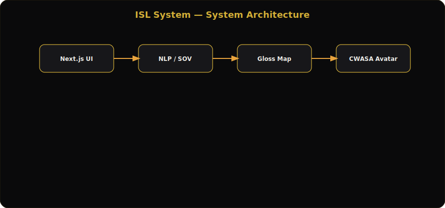
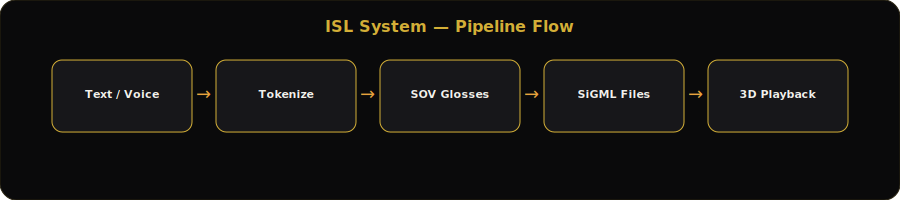
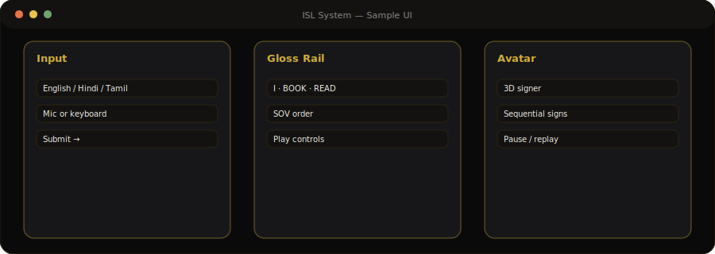

# ISL System — Text to Indian Sign Language

Convert **typed or spoken text** into **Indian Sign Language (ISL)** animations on a **3D signing avatar** — entirely in the browser.

[](https://nextjs.org/)
[](https://react.dev/)
[](https://github.com/SYLESH-1125/ISL_System)

**Live:** [syldeep.vercel.app](https://syldeep.vercel.app) (deploy from this repo)

---

## Architecture



## Pipeline flow



## Sample UI



---

## What it does

| Layer | Technology |
|-------|------------|
| UI | Next.js 16 App Router, React 19, Tailwind CSS 4 |
| Avatar | **CWASA** + **SiGML** (`public/SignFiles/*.sigml`) |
| Lexicon | `isl-dataset.ts` (~1,708 gloss entries) + `SIGML_WORDS` |
| Grammar | Heuristic **SOV** reordering for ISL sentence patterns |
| Input | Keyboard + Web Speech API (English / Hindi / Tamil) |

**User journey:** Enter text → glosses in SOV order → 3D avatar plays each sign sequentially.

---

## Repository layout

```
app/                    # Next.js routes (home = ISLAvatarPlayer)
components/isl/         # InputPanel, AvatarPlayer, GlossDisplay, controls
components/isl-translator-app.tsx
public/SignFiles/       # SiGML sign assets
public/js/allcsa.js     # CWASA runtime
isl-dataset.ts          # Generated lexical mapping
```

---

## Quick start

```bash
git clone https://github.com/SYLESH-1125/ISL_System.git
cd ISL_System
pnpm install   # or npm install
pnpm dev       # http://localhost:3000
```

### Vercel deploy

1. Import **SYLESH-1125/ISL_System** on Vercel  
2. Framework: Next.js · Install: `pnpm install` · Build: `pnpm build`  
3. Large CWASA assets — first load may be slow (normal)

---

## Features

- Real-time gloss rail with SOV ordering  
- Voice input with multi-language speech recognition  
- Dataset viewer — searchable table over 1,700+ signs  
- Playback controls — pause, step, replay per gloss  
- WCAG-minded layout with theme toggle  

---

## Credits

CWASA / SiGML signing technology · ISL dataset curation by **Sylesh Pavendan**

## License

See repository license. CWASA assets subject to their respective terms.
